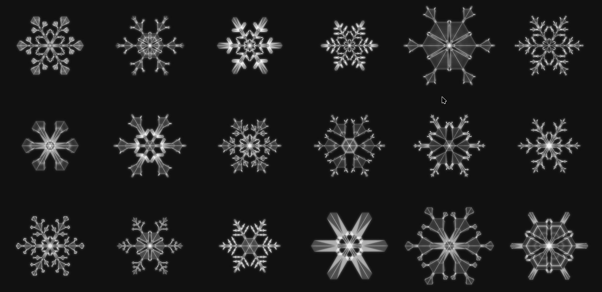

# Snowflake Growth Simulator

[Live Demo](https://mmmacleod.net/snowflake/)

This is a geometric model of snowflake growth inspired by Kenneth G. Libbrecht's book [Snow Crystals](https://www.snowcrystals.com/). It can grow realistic(ish) looking snowflakes, such as the ones below:

