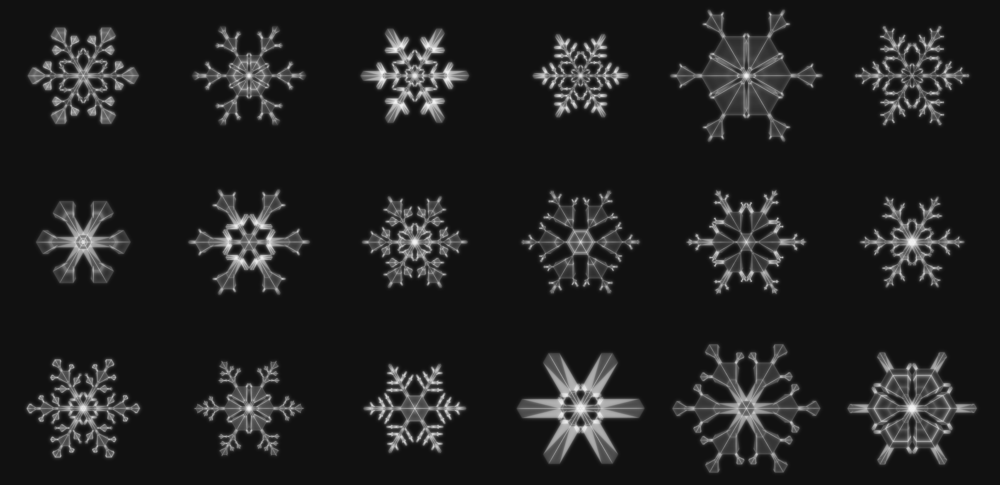

# Snowflake Growth Simulator

[Live Demo](https://mmmacleod.net)

This is a geometric model of snowflake growth inspired by Kenneth G. Libbrecht's book [Snow Crystals](https://www.snowcrystals.com/). It can grow realistic(ish) looking snowflakes, such as the ones below:

### Performance notes

The simulaiton is carefully optimized (avoids major GC collections, uses cache-friendly data structures, etc.) and can grow (from seed to fully grown) any one of the above snowflakes in around 9ms (Google Chrome, AMD Ryzen 9 7940HS w/ Radeon 7). My benchmarks show that its speed is currently bottlenecked by `CanvasRenderingContext2D` `moveTo()` and `lineTo()` calls, which means any future performance improvements will probably come in the form of rewriting the rendering code for the GPU.